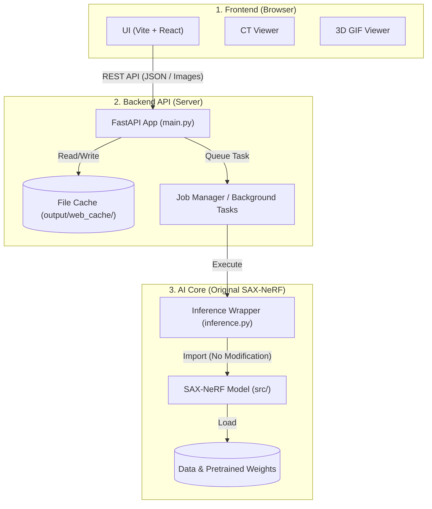
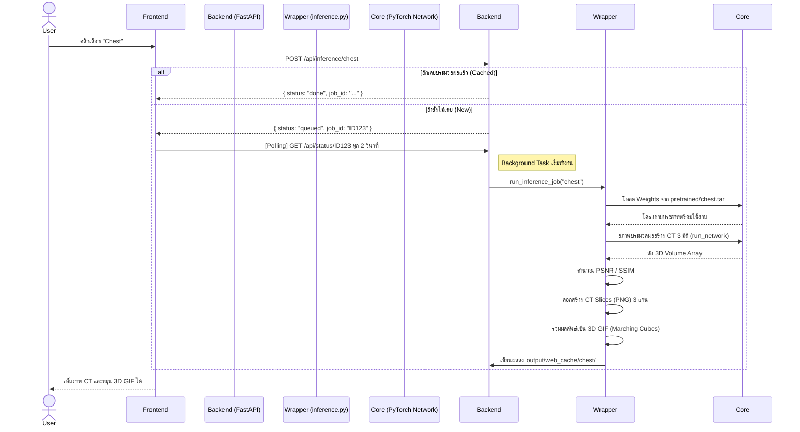

# สถาปัตยกรรมระบบ (System Architecture) ของ SAX-NeRF Web Application

เอกสารฉบับนี้อธิบายโครงสร้างและการทำงานของระบบ SAX-NeRF แบบเจาะลึก โดยแบ่งออกเป็น 2 ส่วนหลักคือ **1. Web Application Layer** (ส่วนที่รับคำสั่งและแสดงผล) และ **2. AI Core Layer** (ส่วนวิจัยหลักที่ใช้ประมวลผลโมเดล)

---

## 1. ภาพรวมของระบบ (System Overview)

ระบบถูกออกแบบมาเป็นแบบ 3-Tier Architecture ที่มีความยืดหยุ่นสูง เพื่อให้หน้าเว็บสามารถเรียกดูผลลัพธ์ 3 มิติเชิงการแพทย์ได้แบบอินเทอร์แอกทีฟ โดยไม่กระทบต่อโครงสร้างโค้ดงานวิจัยเดิม



---

## 2. โครงสร้างโฟลเดอร์ (Directory Tree)

- โค้ดในโฟลเดอร์ `src/`, `config/`, และไฟล์รันเดิมถูกรักษาไว้ในสภาพ 100% เพื่อความเข้ากันได้
- โค้ดสำหรับ Backend ถูกสร้างใหม่ใน `server/`
- โค้ดสำหรับ Frontend ถูกสร้างใหม่ใน `web/`

```
SAX-NeRF/
├── Makefile                 # รวมคำสั่งจัดการโปรเจค (make setup, make dev)
├── setup.sh                 # สคริปต์ติดตั้งสภาพแวดล้อม (Conda, PyTorch, Node.js)
├── docker-compose.yml       # สำหรับการนำไป Deploy ด้วย Docker (ต่อ GPU)
│
├── server/                  # 🟢 ส่วน Backend API (FastAPI)
│   ├── main.py              # กำหนด API Endpoints (Routing)
│   ├── inference.py         # ตัวประสาน (Wrapper) เรียกใช้โค้ด AI และแปลงผลลัพธ์
│   ├── schemas.py           # รูปแบบข้อมูลเข้า-ออก (Pydantic Models)
│   └── config.py            # ตั้งค่า Path และตรวจจับ Scene ที่มีอยู่
│
├── web/                     # 🔵 ส่วน Frontend (Vite + React)
│   ├── src/                 
│   │   ├── api/client.js    # ฟังก์ชันสำหรับยิงเชื่อมต่อเข้า Backend
│   │   ├── components/      # ชิ้นส่วนหน้าเว็บ (CTViewer, SceneGallery, ฯลฯ)
│   │   ├── index.css        # ระบบ Design (Dark Theme, Glassmorphism)
│   │   └── App.jsx          # ควบคุมการทำงานของหน้าเว็บ (State Control)
│   └── package.json
│
├── src/                     # 🧠 ส่วน AI Core (SAX-NeRF เดิม - ไม่แก้ไข)
│   ├── dataset/             # โหลดข้อมูล (.pickle) และจำลองมุมมอง X-ray
│   ├── network/             # AI โมเดล (Line Attention, MLP)
│   ├── render/              # กลไก Ray Marching และ Volume Rendering
│   └── encoder/             # HashGrid สำหรับความเร็วสูง (C++ CUDA)
│
├── data/                    # ไฟล์ข้อมูลดิบ (.pickle) เรียงตามส่วนของร่างกาย
├── pretrained/              # ไฟล์คลื่นน้ำหนักโมเดล (.tar)
└── output/web_cache/        # ไฟล์ที่สร้างแล้ว (CT Slices, GIF) เก็บไว้ให้เว็บโหลดเร็ว
```

---

## 3. Web Application Layer

### 3.1 Frontend (Vite + React)
ระบบหน้าบ้าน (Client-side) ถูกออกแบบให้ตอบสนองเร็วและทันสมัย:
*   **Design System:** ใช้ความสวยงามสไตล์ Glassmorphism บนพื้นหลังสีเข้ม (Dark Theme) เหมาะกับการดูภาพถ่ายทางการแพทย์ 
*   **State Management:** มีศูนย์กลางอยู่ที่ `App.jsx` ดูแลสถานะ 5 แบบคือ: `idle`, `loading`, `running`, `done`, `error`
*   **CT Viewer Component:** โหลดภาพ Cross-section ทีละแกน (Axial, Coronal, Sagittal) และใช้ Slider เพื่อเลื่อนดูแบบอิสระ
*   **GIF Viewer Component:** โชว์ไฟล์ 3D Reconstruction ที่แปลงมาแล้ว
*   **API Client (`api/client.js`):** ซ่อนความซับซ้อนของการใช้ Fetch API จัดการข้อผิดพลาดและแปลงคำตอบอย่างสมบูรณ์

### 3.2 Backend API (FastAPI)
เป็นศูนย์กลาง (Hub) รับคิวและเรียกการทำงานของ AI อย่างเป็นระเบียบ:
*   **Asynchronous Jobs:** ใช้ `BackgroundTasks` ของ FastAPI ยอมให้ระบบส่งคำสั่งรัน AI พร้อมเก็บ Job ID โดยที่ระบบ Backend ไม่ค้าง
*   **Smart Caching:** โค้ดใน `config.py` และ `inference.py` จะเช็คเสมอว่า Scene นี้ (เช่น `chest`) เคยทำ Reconstruction และบันทึก GIF ไว้ที่ `output/web_cache/` หรือยัง ถ้ามีแล้วจะคืนค่าผลลัพธ์ให้เว็บแบบเสี้ยววินาที (ไม่ต้องรัน AI ใหม่)
*   **Inference Wrapper:** โค้ด `server/inference.py` ทำหน้าที่ดึงสคริปต์ `test.py` ของ SAX-NeRF มาทำให้เชื่อง เปลี่ยนการ Output ลงไฟล์แบบกระจัดกระจาย มาเป็นการสร้าง Slice รูปภาพและรวมตึกให้เป็นข้อมูล JSON/GIF ส่งกลับให้หน้าเว็บ

---

## 4. AI Core Layer (SAX-NeRF)

ส่วนวิจัยดั้งเดิมที่รับผิดชอบการแปลงภาพ X-ray ห่างๆ 50 มุม ให้กลายเป็นตึกโมเดล 3D เสมือนจริง ประกอบด้วยฟันเฟืองทางคณิตศาสตร์ 4 ส่วน:

### 4.1 Data Processing (`dataset/tigre.py`)
ระบบทำงานบนไฟล์ **`.pickle`** ที่บันทึกโครงสร้างทางเรขาคณิต (Geometry) แบบ Cone-beam
*   ใช้ TIGRE Toolbox ในการคำนวณทิศทางการยิงมุมกล้อง X-ray
*   แต่ละโมเดลจะเก็บภาพการส่องฉายที่ 50 มุม เพื่อจำลองสถานการณ์ Sparse-view

### 4.2 Encoding Layer (`encoder/hashencoder/`)
ใช้กลไก **Multi-Resolution Hash Encoding** (คล้าย Instant-NGP)
*   ถูกคอมไพล์เป็น C++ CUDA Extension ทำให้โมเดลสามารถดึงข้อมูลพิกัด (x, y, z) เปลี่ยนเป็น Features ไปป้อนในโครงข่ายประสาทได้เร็วขึ้นมหาศาล

### 4.3 Network Architecture (`network/`)
เทคนิคชั้นสูงที่สร้างจุดเด่นให้ตระกูล SAX-NeRF: **Lineformer (Line Attention)**
*   โมเดลจะรับค่า Feature มาจากแสงที่วิ่งผ่านโครงสร้าง อัลกอริทึมจะรู้ว่ารังสีใดเดินทางใกล้ขอบกระดูก/อวัยวะ (Structural-Aware) 
*   ผสมการใช้ Multi-Layer Perceptron (MLP) อย่างง่ายในการทายว่าจุดทุกจุดในอวกาศ (Voxel) มีความหนาแน่นและสีเท่าใด

### 4.4 Volume Rendering (`render/render.py`)
ตัวจำลองหลักการของแสง X-ray (Ray Marching)
*   โมเดลจะยิงแสงทะลุปริมาตรเพื่อสุ่มจุด (Stratified Sampling) จากนั้นนำความหนาแน่นในจุดต่างๆ มาบวก/สะสมกันตามหลักฟิสิกส์ (Alpha Compositing) เพื่อตรวจทายว่าภาพ 2 มิติที่ออกมาจะหน้าตาเป็นอย่างไร เทียบกับของจริง (GT) เพื่อหา Loss ไปสอน Network

---

## 5. แผนผังการเรียกทำงาน (Inference Data Flow)

ลำดับการทำงานเมื่อ User กดคลิกบนหน้าเว็บเพื่อทำงานร่วมกับ AI Model:



---

## 6. แนวทางการพัฒนาในอนาคต (Future Work - Phase 2)

*   **Training & Custom Data:** ปัจจุบันระบบรองรับเฉพาะโหมด Inference บนข้อมูลชุดที่มีอยู่ อนาคตจะเพิ่ม API ฝั่ง Training ที่รองรับฟอร์มอัปโหลดภาพ X-ray มุมน้อย (Custom Data) และสร้างไฟล์ TIGRE `.pickle` แบบอัตโนมัติ
*   **Job Queues:** ถ้าผู้ใช้ทำงานพร้อมๆ กัน (Concurrency) จะมีการนำ Celery และ Redis เข้ามาจัดคิว เพื่อไม่ให้ GPU VRAM (12GB) เต็ม
*   **Cluster Integration:** เชื่อมรันคำสั่งเข้ากับ HPC ของ DGX Server (SLURM Queue) ผ่านตัวกลาง แทนการรันบนเครื่อง Local Node ตลอดเวลา
