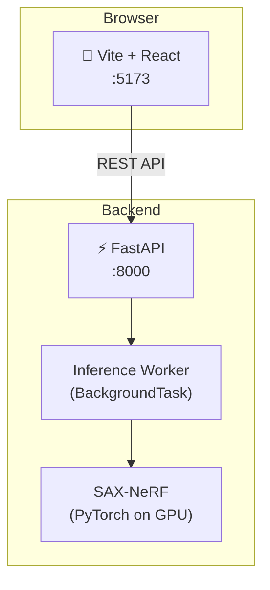

<div align="center">

# SAX-NeRF: Interactive Web Demo

[](https://arxiv.org/abs/2311.10959)
[](https://github.com/caiyuanhao1998/SAX-NeRF)
[](https://vitejs.dev/)
[](https://fastapi.tiangolo.com/)

A beautiful, interactive web application wrapper for the **Structure-Aware Sparse-View X-ray 3D Reconstruction (SAX-NeRF)** project.

</div>

<br/>

## ✨ Features

This repository extends the original SAX-NeRF research code with a modern 3-tier web application architecture:

- **🎨 Beautiful Frontend (Vite + React):** Dark theme, glassmorphism UI, Scene Gallery, interactive CT slice viewer (3-axis slider), and 3D rotating GIF playback.
- **⚡ Backend API (FastAPI):** Python REST API handling background inference queues and caching.
- **🛠️ Zero-touch Core:** The original `src/` code from the CVPR paper remains completely untouched for research integrity.
- **📦 Portable Deployment:** One-command setup (`bash setup.sh`) spanning Conda, PyTorch, pnpm, and Docker support.

---

## 🚀 Quick Start

### 1. System Requirements
- Linux or WSL2
- NVIDIA GPU with at least 8GB VRAM (Tested perfectly on RTX 4070 12GB)
- CUDA 11.3+
- [Miniconda](https://docs.conda.io/en/latest/miniconda.html)

### 2. Clone & Setup
```bash
git clone https://github.com/Eakkachad/xray_to_3d.git
cd xray_to_3d

# This will automatically create a conda env, install PyTorch, pnpm, and all dependencies
bash setup.sh
```

### 3. Download Data & Pretrained Weights
Before running, you must download the datasets and pretrained weights from the original authors:

1. Download `.pickle` files from [Google Drive (Data)](https://drive.google.com/drive/folders/1SlneuSGkhk0nvwPjxxnpBCO59XhjGGJX) and place them in the `data/` folder.
2. Download `.tar` files from [Google Drive (Pretrained)](https://drive.google.com/drive/folders/1wlDrZQRbQENcfW1Pjrr1gasFQ8v6znHV) and place them in the `pretrained/` folder.

*Tip: The web app checks these folders and will grey out scenes you haven't downloaded yet.*

### 4. Run the Web App
```bash
# Activate the environment
conda activate sax_nerf

# Run both FastAPI backend and Vite frontend concurrently
make dev
```
Open your browser and navigate to: **http://localhost:5173**

---

## 🏛️ Architecture



---

## 📜 Credits & Citation

This web application wraps the amazing research from **Yuanhao Cai et al. (CVPR 2024)**. 

Please consider citing their original work if you find this useful:

```bibtex
@inproceedings{sax_nerf,
  title={Structure-Aware Sparse-View X-ray 3D Reconstruction},
  author={Yuanhao Cai and Jiahao Wang and Alan Yuille and Zongwei Zhou and Angtian Wang},
  booktitle={CVPR},
  year={2024}
}
```
*Original Repository: [caiyuanhao1998/SAX-NeRF](https://github.com/caiyuanhao1998/SAX-NeRF)*
